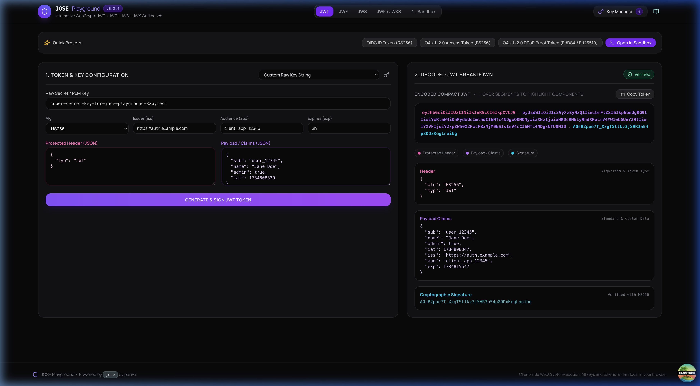
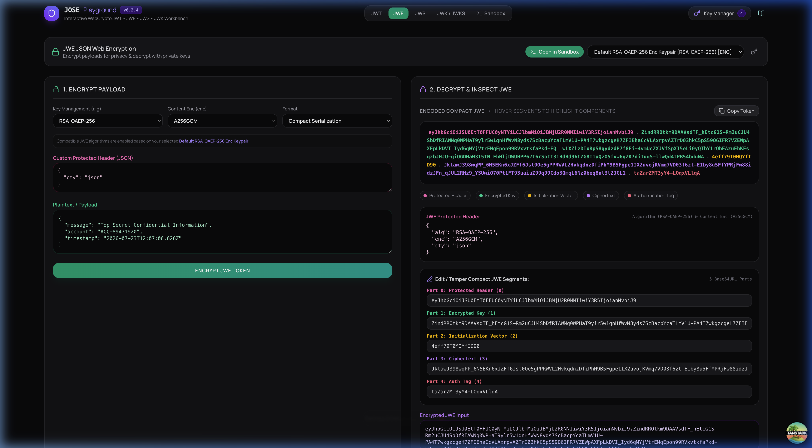
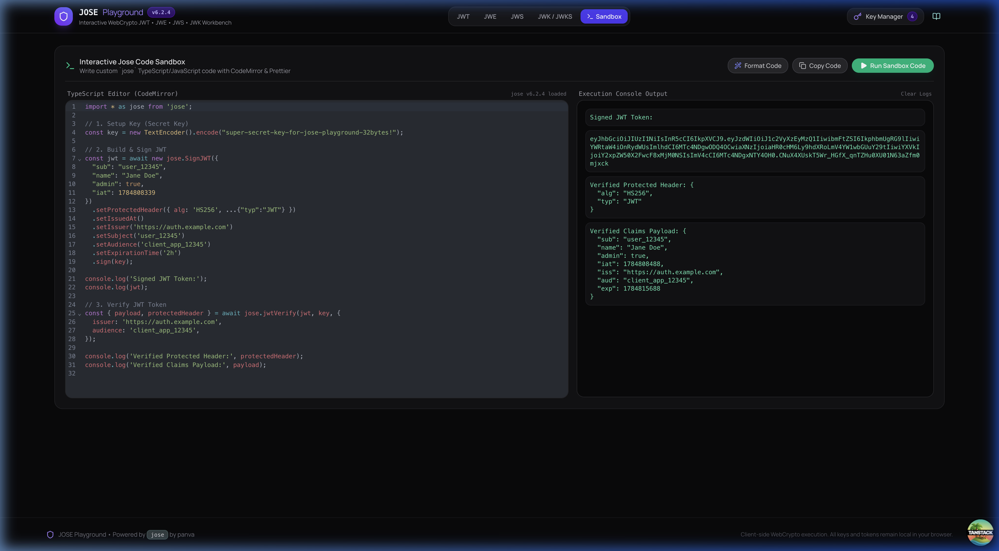
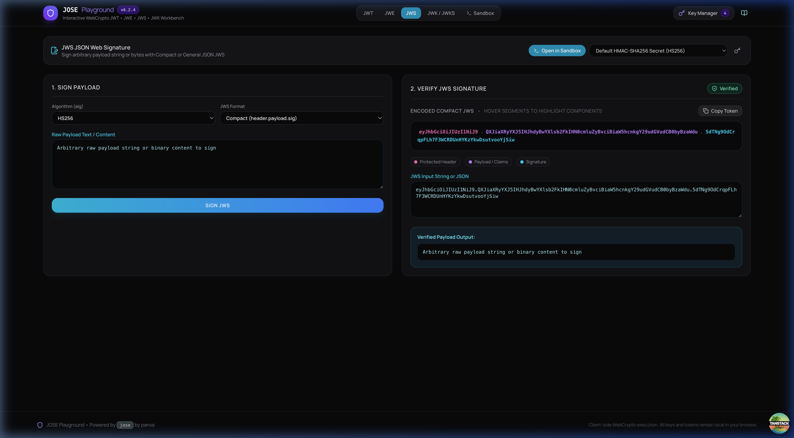
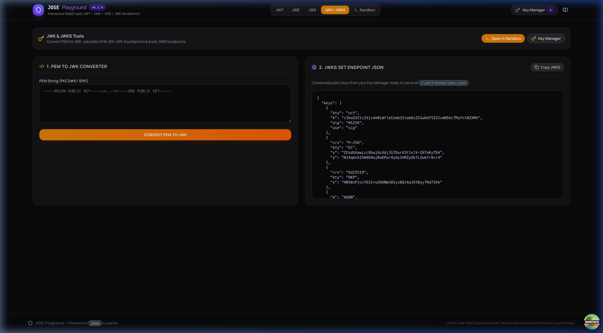
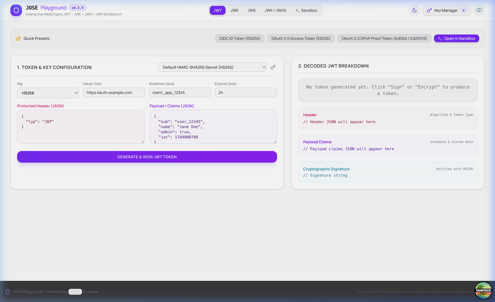

# JOSE Playground 🔐

An interactive, browser-based playground for **JavaScript Object Signing and Encryption (JOSE)** standards (**JWT**, **JWE**, **JWS**, **JWK**, and **JWKS**) powered by panva's [`jose`](https://github.com/panva/jose) v6 library, CodeMirror, Prettier, and TanStack Start.

🔗 **Repository**: [github.com/mertdogar/jose-playground](https://github.com/mertdogar/jose-playground)

---

## 📸 Screenshots

### 🛡️ JWT Signer & Visual Inspector


### 🔒 JWE Encryption & 5-Part Segment Tamper Tool


### 💻 CodeMirror TypeScript Sandbox & Live Console Output


### ✍️ JWS Signature Workbench


### 🔑 JWK & JWKS Endpoint Generator


### 🌗 Light Theme View


---

## ✨ Features

### 🔑 1. Global Key Manager
- **WebCrypto Key Generation**: Generate RSA, EC (P-256, P-384, P-521), EdDSA (Ed25519), HMAC, and AES keys directly in-browser using WebCrypto.
- **Import & Export**: Import/export keys in **JWK (JSON Web Key)** format or **PEM (SPKI / PKCS#8)** format.
- **Local Storage Persistence**: Keys are pre-seeded and saved safely in `localStorage`.

### 🛡️ 2. JWT Workbench (JSON Web Token)
- **Sign & Verify**: Create signed JWTs with custom protected headers, claims (`iss`, `sub`, `aud`, `exp`), and algorithms (`HS256`, `RS256`, `ES256`, `EdDSA`).
- **Interactive Color-Coded Inspector**: Visual token breakdown highlighting **Header** (Pink), **Payload** (Purple), and **Signature** (Cyan) with hover synchronization.
- **Quick Presets**: Pre-loaded templates for OIDC ID Tokens, OAuth 2.0 Access Tokens, and DPoP Proof Tokens.
- **Open in Sandbox**: 1-click transfer of current JWT configuration into a runnable TypeScript script.

### 🔒 3. JWE Workbench (JSON Web Encryption)
- **Encryption & Decryption**: Support for asymmetric key management (`RSA-OAEP-256`, `ECDH-ES`), symmetric wrapping (`A128KW`, `A256KW`), direct encryption (`dir`), and content encryption (`A256GCM`, `A128GCM`, `A128CBC-HS256`).
- **Custom Protected Header JSON Editor**: Edit custom JWE headers (`cty`, `zip`, `kid`, etc.).
- **Interactive 5-Part Segment Tamper Tool**: Edit or tamper with any of the 5 raw JWE Base64URL parts (**Header**, **Encrypted Key**, **IV**, **Ciphertext**, **Authentication Tag**) in real time to observe decryption/integrity failures.
- **Dynamic Algorithm Filtering**: Automatically disables incompatible algorithm options based on the active key type.

### ✍️ 4. JWS Workbench (JSON Web Signature)
- **Compact & General JSON Serialization**: Sign and verify arbitrary payload strings or binary data.
- **Verification Badges**: Instant cryptographic status indicators.

### 🔑 5. JWK & JWKS Workbench
- **PEM to JWK Converter**: Convert PKCS#8 or SPKI PEM keys into JSON Web Key objects.
- **SHA-256 JWK Thumbprints**: Calculate thumbprints (`jose.calculateJwkThumbprint`) and URIs.
- **JWKS Endpoint Generator**: Generate ready-to-serve `/.well-known/jwks.json` endpoint payloads from stored keys.

### 💻 6. Interactive Code Sandbox
- **CodeMirror Editor**: Full TypeScript & JavaScript syntax highlighting with `@uiw/react-codemirror` and `@codemirror/theme-one-dark`.
- **Prettier Formatter**: 1-click code formatting using `prettier/standalone`.
- **In-Browser Execution**: Safe live evaluation of `jose` code snippets with console output logging.

### 🌗 7. Light & Dark Themes
- **Theme Selector**: Sun/Moon toggle button with persistent `localStorage` preference and high-contrast color palettes.

---

## 🛠️ Tech Stack

- **Framework**: [TanStack Start](https://tanstack.com/start) / React 19 / Vite 8
- **Cryptography**: [`jose`](https://github.com/panva/jose) v6 (WebCrypto standard API)
- **Code Editor**: [@uiw/react-codemirror](https://uiwjs.github.io/react-codemirror/) & [@codemirror/lang-javascript](https://github.com/codemirror/lang-javascript)
- **Code Formatter**: [Prettier](https://prettier.io/) (standalone browser bundle)
- **Styling**: Tailwind CSS v4
- **Icons**: Lucide React

---

## 🚀 Getting Started

### Prerequisites

- Node.js `^20.0.0` or higher
- `pnpm` `^9.0.0` or higher

### Installation

```bash
# Clone the repository
git clone https://github.com/mertdogar/jose-playground.git
cd jose-playground

# Install dependencies
pnpm install

# Start local development server
pnpm dev
```

Open [http://localhost:3000](http://localhost:3000) in your browser.

---

## 📦 Scripts

- `pnpm dev`: Start local Vite dev server on port 3000.
- `pnpm build`: Build production application with Nitro server adapter.
- `pnpm preview`: Preview production build locally.
- `pnpm generate-routes`: Regenerate TanStack Router route tree (`routeTree.gen.ts`).

---

## 📄 License

[MIT License](LICENSE) © Mert Dogar
